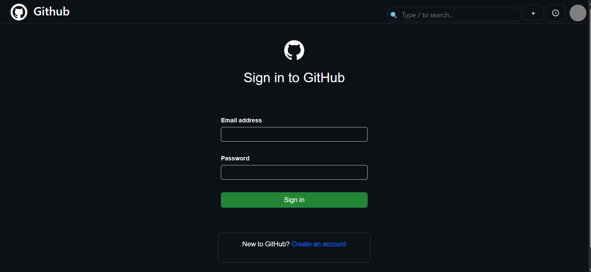
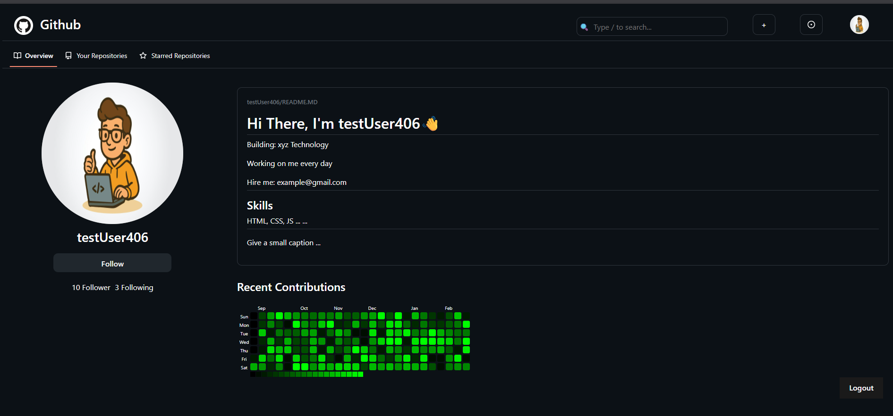

# 📂 Version Control System (GitHub Clone)

> ⚠️ **Note:** This project is currently **under development**. Features and UI are being actively improved.

A **full-stack version control system** inspired by GitHub, built using the **MERN Stack**.  
It allows users to authenticate, manage repositories, and perform basic version control operations with a clean and responsive UI.

---

## 🛠 Tech Stack
- **Frontend:** React.js, CSS, Bootstrap  
- **Backend:** Node.js, Express.js  
- **Database:** MongoDB  
- **Other:** Git, GitHub for version control  

---

## 📸 Screenshots
| Login Page | Profile Page | Create Repository |
|------------|--------------|-------------------|
|  |  |  |

*(Screenshots will be updated as the project progresses)*

---

## 🚀 Features (Planned)
- 🔐 User Authentication (Signup/Login)  
- 📁 Repository creation & management  
- 📄 File upload and commit tracking  
- 👥 User profiles with repositories  
- 🌐 Responsive UI with clean design  

---

## 📂 Setup Instructions

```bash
# Clone the repo
git clone https://github.com/mishraRj/Version-Control-System.git
cd Version-Control-System

# Install dependencies for backend & frontend separately
cd server && npm install
cd ../client && npm install

# Run backend
cd server && npm start

# Run frontend
cd ../client && npm start
