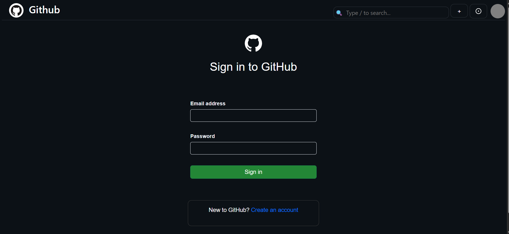
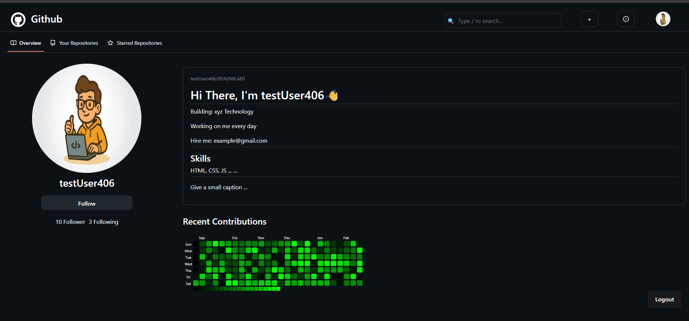
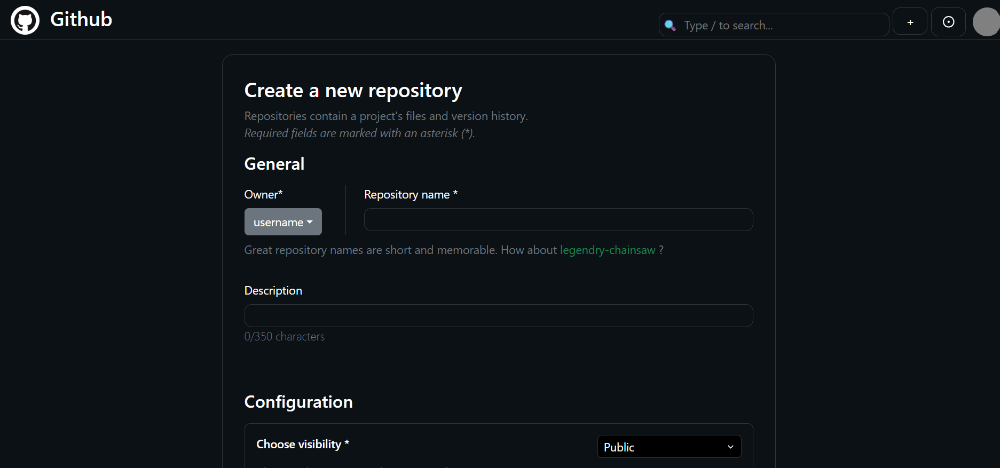

# 📂 Version Control System (GitHub Clone)

> ⚠️ **Note:** This project is currently **under development**. Features and UI are being actively improved.

A **full-stack version control system** inspired by GitHub, built using the **MERN Stack**.  
It allows users to authenticate, manage repositories, and perform basic version control operations with a clean and responsive UI.

---

## 🛠 Tech Stack
- **Frontend:** React.js, CSS, Bootstrap  
- **Backend:** Node.js, Express.js  
- **Database:** MongoDB  
- **Other:** Git, GitHub for version control  

---

## 📸 Screenshots
| Login Page | Profile Page | Create Repository |
|------------|--------------|-------------------|
|  |  |  |

*(Screenshots will be updated as the project progresses)*

---

## 🚀 Features (Planned)
- 🔐 User Authentication (Signup/Login)  
- 📁 Repository creation & management  
- 📄 File upload and commit tracking  
- 👥 User profiles with repositories  
- 🌐 Responsive UI with clean design  

---

## 📂 Setup Instructions


This is a full-stack project with two main folders:  

- `frontend` → React app  
- `backend` → Node.js app  

This guide explains how to **fork, set up, and run the project locally** using **VS Code**.

---

## 📌 Prerequisites

Make sure you have installed:

- [Node.js](https://nodejs.org/) (v16+ or v18+ recommended)  
- [Git](https://git-scm.com/)  
- [Visual Studio Code](https://code.visualstudio.com/)  

---

## 🔗 Fork & Clone the Repository

1. **Fork** this repository (click the **Fork** button in GitHub).  
2. **Clone your fork** to your local machine:

```bash
# Using SSH
git clone git@github.com:YOUR-GITHUB-USERNAME/REPO-NAME.git

# Or using HTTPS
git clone https://github.com/YOUR-GITHUB-USERNAME/REPO-NAME.git
```

🖥 Open Project in VS Code

From the root folder:
```bash
code .
```
Or open VS Code → File → Open Folder… → select the project folder.

📦 Install Dependencies

Run the following commands inside VS Code terminal:

```bash
# Frontend dependencies
cd frontend
npm install

# Backend dependencies
cd ../backend
npm install
```

▶️ Run the Project

You need two terminals running in parallel in VS Code.

Step 1: Open two terminals

Go to Terminal → New Terminal
Then click the Split Terminal button (▭▭) to create a second terminal.

Step 2: Run frontend and backend

```bash
# Terminal A → Frontend
cd frontend
npm run dev

# Terminal B → Backend
cd backend
node server.js start
```

🌐 View in Browser

Once both servers are running, open:
```bash
👉 http://localhost:5173
```

Now project should run smooth on your device.

